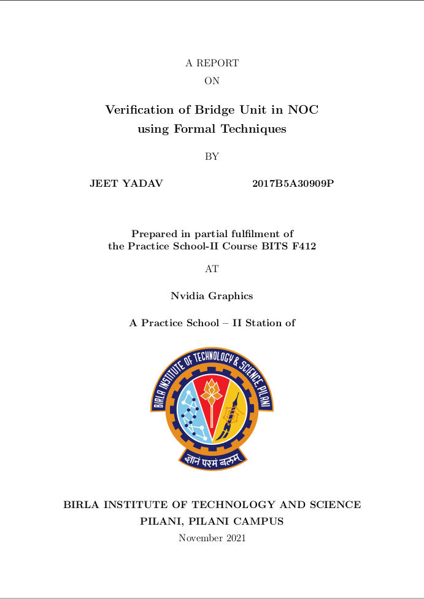
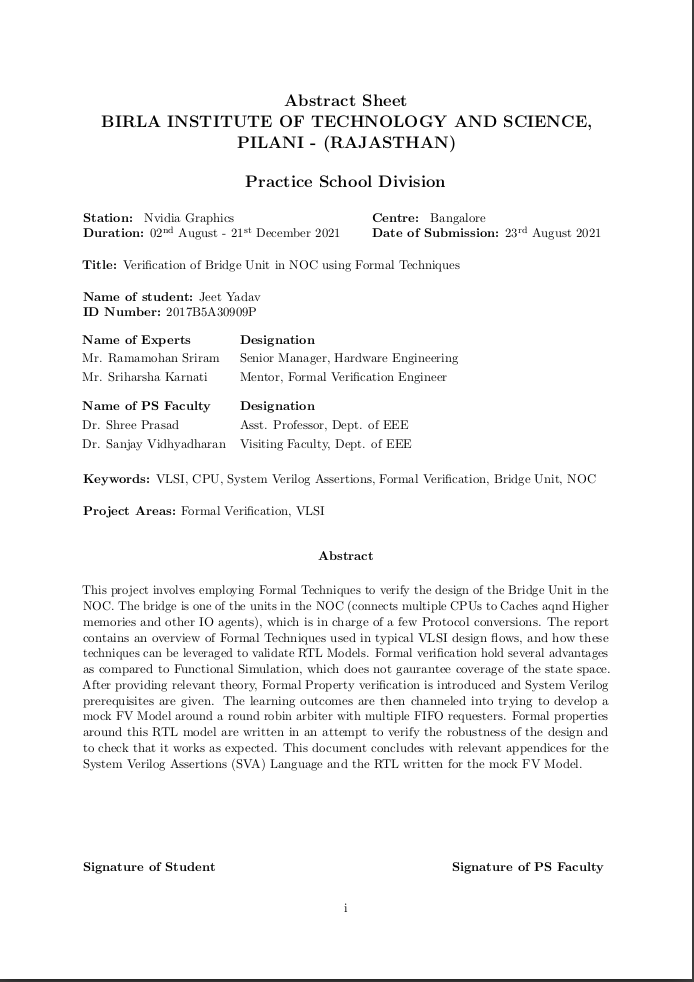

# bits-pilani-ps-report-template-latex
LaTex Template for BITS Practice School Reports

This is an easy to use LaTeX template to generate great Practice School reports. This is heavily influenced by previous thesis templates.
This template adheres to the exact document specifications for PS reports as of 2021. 

Shown below are a sample title page and abstract sheet:
<table>
    <tr>
        <td>
            <center></center>
        </td>
        <td>
            <center></center>
        </td>
    </tr>
</table>


## Usage

This template is built around a class, which means that any tex file can use it for the document format. However, for convenience
it is recommended to make a copy of this project and adapt it as required.

This can be done in two ways:

* Fork and clone this repository to your local computer. Edit and compile as needed.
* Import this github project (or your fork) into [overleaf](https://www.overleaf.com/).

The title page, abstract sheet, bibliography and everything in between is generated automatically.
To change your details, refer to the ```variables.tex``` file. Apart from that, your content belongs to the other tex files (Chapters, Appendices etc.),
which are imported into ```main.tex```. 
This template has examples built in for easy adaptation. Please remove any of the placeholder text (lorem ipsum) accordingly.

## Notes
* Suggestions and pull requests are welcome.
* Credit to Nishant Raman for providing a base for me to work on.
